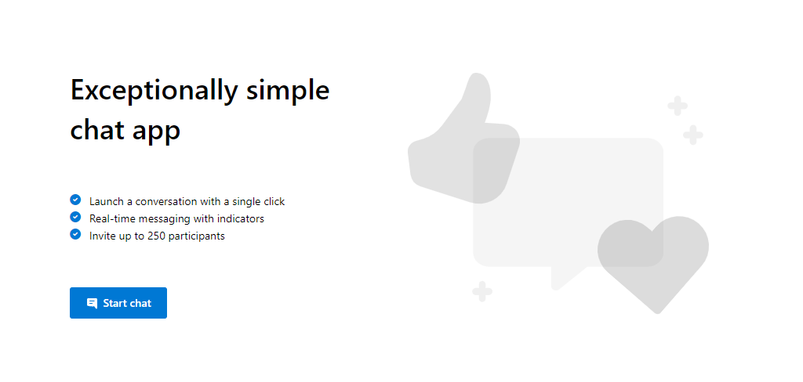

# Group Chat Sample

This is a sample application to show how the Chat Web SDK can be used to build a single threaded chat experience. 
The client-side application is a React based user interface which uses Redux for handling complex state while leveraging Microsoft Fluent UI. 
Powering this front-end is a C# web application powered by ASP.NET Core to connect this application with Azure Communication Services.

The sample has been extended to include file sharing capabilities between meeting participants.

Additional documentation for this sample can be found on [Microsoft Docs](https://docs.microsoft.com/en-us/azure/communication-services/samples/chat-hero-sample).

## Prerequisites

- Create an Azure account with an active subscription. For details, see [Create an account for free](https://azure.microsoft.com/free/?WT.mc_id=A261C142F).
- [Node.js (12.18.4 and above)](https://nodejs.org/en/download/)
- Create an Azure Communication Services resource. For details, see [Create an Azure Communication Resource](https://docs.microsoft.com/en-us/azure/communication-services/quickstarts/create-communication-resource). You'll need to record your resource **connection string** for this quickstart.
- Create an Azure Storage (general purpose v2) resource. You'll need to record your resource **connection string** for this quickstart. Alternatively, you can use the [Azure Storage Emulator](https://docs.microsoft.com/en-us/azure/storage/common/storage-use-emulator) for development, along with the emulator's shortcut connection string: `UseDevelopmentStorage=true`.

## Code structure

> NOTE: This section has not been updated to reflect the Node API.

- ./Chat/ClientApp: frontend client
  - ./Chat/ClientApp/src
    - ./Chat/ClientApp/src/Components : React components to help build the client app chat experience
    - ./Chat/ClientApp/src/Containers : Connects the redux functionality to the React components
    - ./Chat/ClientApp/src/Core : Containers a redux wrapper around the Chat SDK
    - ./Chat/ClientApp/src/index.js : Entry point for the client app
- ./Chat/Controllers : Server app core logic for client app to get a token to use with the ACS Web Chat SDK
- ./Chat/Program.cs : Server app program logic
- ./Chat/Startup.cs: Server app startup logic

## Before running the sample for the first time

1. Open an instance of PowerShell, Windows Terminal, Command Prompt or equivalent and navigate to the directory that you'd like to clone the sample to.
2. `git clone https://github.com/navzam/communication-services-web-chat-hero-files.git`
3. Get the `Connection String` from the Azure portal for the ACS resource. For more information on connection strings, see [Create an Azure Communication Resources](https://docs.microsoft.com/en-us/azure/communication-services/quickstarts/create-communication-resource)
4. Get the `Connection String` from the Azure portal for the Azure Storage resource.
5. Add the connection strings to the `Chat/NodeApi/.env` file. Input your connection strings in the variables: `ACS_CONNECTION_STRING` and `STORAGE_CONNECTION_STRING`.
6. In a terminal, navigate to `Chat/NodeApi/` and run `npm install`.
7. In a terminal, navigate to `Chat/ClientApp/` and run `npm install`.

## Local run

1. In a terminal, navigate to `Chat/NodeApi/` and run `npm run watch`.
2. In a terminal, navigate to `Chat/ClientApp/` and run `npm run start`.
2. Once the client app server is running, open a browser to `localhost:3000`.

### Troubleshooting

> NOTE: This section has not been updated to reflect the Node API.

1. Solution doesn\'t build, it throws errors during NPM installation/build

    Clean/rebuild the C# solution

## Publish to Azure

> NOTE: This section has not been updated to reflect the Node API.

1. Right click the `Chat` project and select Publish
2. Create a new publish profile and select your app name, Azure subscription, resource group and etc.
3. Before publish, add your connection string with `Edit App Service Settings`, and fill in `ResourceConnectionString` as key and connection string (copy from appsettings.json) as value

## Additional Reading

- [Azure Communication Chat SDK](https://docs.microsoft.com/en-us/azure/communication-services/concepts/chat/sdk-features) - To learn more about the chat web sdk
- [Redux](https://redux.js.org/) - Client-side state management
- [FluentUI](https://developer.microsoft.com/en-us/fluentui#/) - Microsoft powered UI library
- [React](https://reactjs.org/) - Library for building user interfaces
- [Express](https://expressjs.com/) - Node.js framework for building web applications
